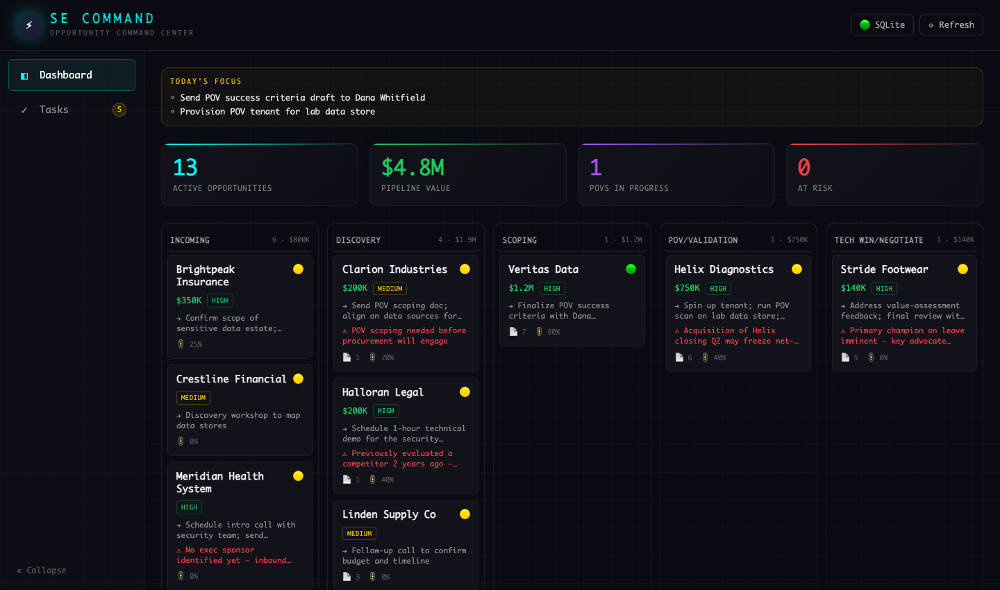

# SE Command Center

A self-contained **opportunity pipeline dashboard for sales engineers** — real-time
deal health, a drag-and-drop SE-stage Kanban, per-opportunity intelligence, and a
task board, backed by a local SQLite database.



> **Demo data.** This repo ships with a fictional pipeline (companies, people,
> and deals are invented — "Aegis Data Security" is a placeholder vendor). Run
> `npm run seed` to generate it.

## Features

- **Live dashboard** — active opportunities, pipeline value, POVs in progress, at-risk count
- **Pipeline Kanban** — five SE stages (Incoming → Discovery → Scoping → POV/Validation → Tech Win/Negotiate) with drag-to-restage
- **Deal-health scoring** — per-opportunity signals (Executive Sponsor, Technical Champion, Budget Holder Access, Compelling Event, Competition) rolled into a 🟢/🟡/🔴 health, with hover context
- **Opportunity panel** — status, quick actions, deal-health signals, depth signals (MEDDICC-style), documents (TSP/POV/RFI/BVA), and recent progress
- **Tasks** — Today / This Week / Backlog / Completed board with persistence
- **Open connectors** — outbound integrations (transcript source, conversation intelligence, calendar/email, LLM) are stubbed as documented plugs; see [`v2/CONNECTORS.md`](v2/CONNECTORS.md)

## Stack

React 19 · TypeScript · Vite · Tailwind v4 · Zustand · Express 5 · better-sqlite3

## Quick start

```bash
cd v2
npm install
npm run seed     # generate the demo pipeline.db
npm run dev      # frontend :5173  +  server :3001
```

Open http://localhost:5173.

## Architecture

```
React (Vite) ──HTTP──► Express API ──► SQLite (pipeline.db)
   stores/hooks            routes/services      source of truth
        │
        └─ open connectors (dormant): notion · zoom · google · bedrock
```

- **Data layer** — `pipeline.db` is the source of truth. The server maps rows to
  the `Opportunity` shape and computes deal health.
- **Config** — org-specific values (owner, CRM URL, vendor/app name) are env-driven
  with generic defaults; copy [`v2/.env.example`](v2/.env.example) to `.env.local`.
- **Connectors** — see [`v2/CONNECTORS.md`](v2/CONNECTORS.md) for the plug/socket model.

## Scripts

| Command | Purpose |
|---|---|
| `npm run dev` | Frontend + server (hot reload) |
| `npm run seed` | Create the demo database (`-- --force` to overwrite) |
| `npm run init-db` | Create an empty schema (no data) |
| `npm run build` | Production build |

## Data model

SQLite tables: `opportunities`, `health_signals`, `depth_signals`, `champion_scores`,
`stakeholders`, `documents`, `progress`, `tasks`, `changelog`. Schema in
[`v2/scripts/schema.ts`](v2/scripts/schema.ts).
